# BookLeaf Architecture & Design Documentation

## Table of Contents
1. [System Architecture Diagram](#system-architecture)
2. [Component Interaction Diagram](#component-interactions)
3. [Data Flow Diagram](#data-flows)
4. [Database Schema](#database-schema)
5. [API Architecture](#api-architecture)
6. [AI/RAG Pipeline](#ai-rag-pipeline)
7. [Deployment Architecture](#deployment-architecture)

---

## System Architecture

### High-Level System Architecture Diagram

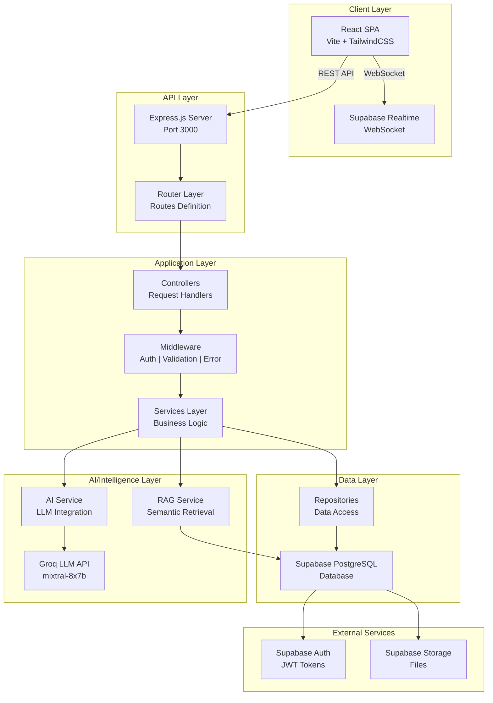

---

## Component Interactions

### Request Flow: Creating and Processing a Ticket

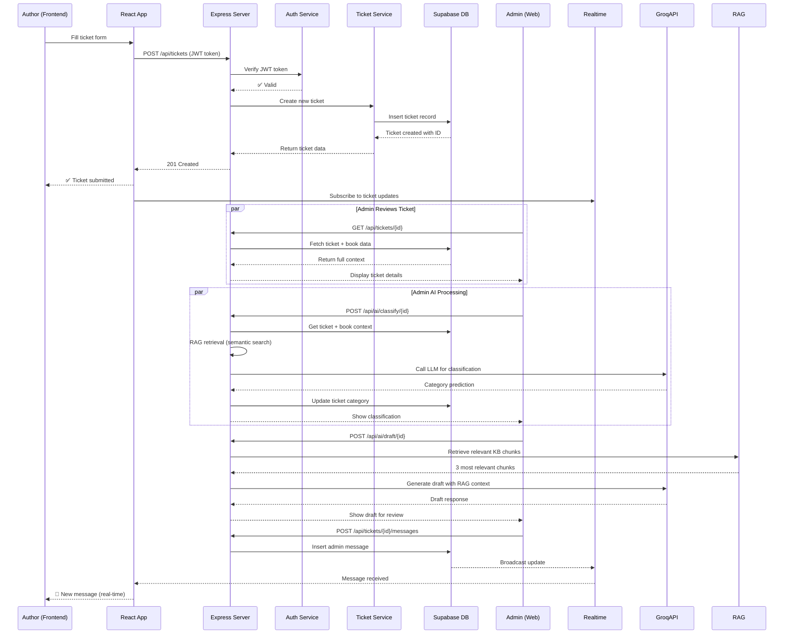

---

## Data Flows

### AI-Powered Response Generation Flow

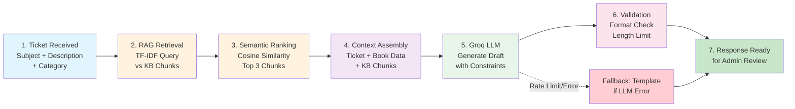

### Real-time Message Update Flow

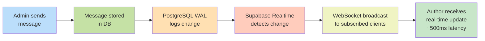

---

## Database Schema

### Entity Relationship Diagram

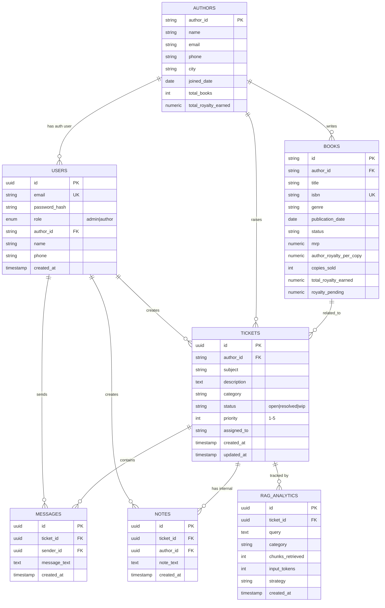

### Database Tables Detail

#### Users Table
```sql
CREATE TABLE users (
    id UUID PRIMARY KEY DEFAULT uuid_generate_v4(),
    email VARCHAR(255) UNIQUE NOT NULL,
    password_hash VARCHAR(255) NOT NULL,
    role ENUM ('admin', 'author') DEFAULT 'author',
    author_id VARCHAR(50) UNIQUE REFERENCES authors(author_id),
    name VARCHAR(255),
    phone VARCHAR(20),
    created_at TIMESTAMP DEFAULT NOW(),
    updated_at TIMESTAMP DEFAULT NOW()
);

CREATE INDEX idx_users_email ON users(email);
CREATE INDEX idx_users_author_id ON users(author_id);
```

#### Books Table
```sql
CREATE TABLE books (
    id VARCHAR(50) PRIMARY KEY,
    author_id VARCHAR(50) NOT NULL REFERENCES authors(author_id),
    title VARCHAR(255) NOT NULL,
    isbn VARCHAR(20) UNIQUE,
    genre VARCHAR(100),
    publication_date DATE,
    status VARCHAR(100) DEFAULT 'In Production',
    mrp NUMERIC(10,2),
    author_royalty_per_copy NUMERIC(10,2),
    copies_sold INT DEFAULT 0,
    total_royalty_earned NUMERIC(12,2),
    royalty_paid NUMERIC(12,2) DEFAULT 0,
    royalty_pending NUMERIC(12,2),
    last_royalty_payout_date DATE,
    print_partner VARCHAR(100),
    available_on TEXT[],
    created_at TIMESTAMP DEFAULT NOW()
);

CREATE INDEX idx_books_author ON books(author_id);
CREATE INDEX idx_books_isbn ON books(isbn);
CREATE INDEX idx_books_status ON books(status);
```

#### Tickets Table
```sql
CREATE TABLE tickets (
    id UUID PRIMARY KEY DEFAULT uuid_generate_v4(),
    author_id VARCHAR(50) NOT NULL REFERENCES authors(author_id),
    subject VARCHAR(255) NOT NULL,
    description TEXT,
    category VARCHAR(50),
    status VARCHAR(50) DEFAULT 'open',
    priority INT DEFAULT 3,
    assigned_to VARCHAR(255),
    created_at TIMESTAMP DEFAULT NOW(),
    updated_at TIMESTAMP DEFAULT NOW()
);

-- Enable Realtime for live updates
ALTER TABLE tickets REPLICA IDENTITY FULL;
ALTER PUBLICATION supabase_realtime ADD TABLE tickets;

CREATE INDEX idx_tickets_author ON tickets(author_id);
CREATE INDEX idx_tickets_status ON tickets(status);
CREATE INDEX idx_tickets_category ON tickets(category);
CREATE INDEX idx_tickets_created ON tickets(created_at DESC);
```

#### Messages Table
```sql
CREATE TABLE messages (
    id UUID PRIMARY KEY DEFAULT uuid_generate_v4(),
    ticket_id UUID NOT NULL REFERENCES tickets(id) ON DELETE CASCADE,
    sender_id UUID NOT NULL REFERENCES users(id),
    message_text TEXT NOT NULL,
    created_at TIMESTAMP DEFAULT NOW()
);

-- Enable Realtime + RLS
ALTER TABLE messages REPLICA IDENTITY FULL;
ALTER PUBLICATION supabase_realtime ADD TABLE messages;
ALTER TABLE messages ENABLE ROW LEVEL SECURITY;

-- Row Level Security Policies
CREATE POLICY "allow_select_messages" ON messages FOR SELECT USING (true);
CREATE POLICY "allow_insert_messages" ON messages FOR INSERT WITH CHECK (auth.uid()::text = sender_id::text);

CREATE INDEX idx_messages_ticket ON messages(ticket_id);
CREATE INDEX idx_messages_sender ON messages(sender_id);
CREATE INDEX idx_messages_created ON messages(created_at DESC);
```

#### RAG Analytics Table
```sql
CREATE TABLE rag_analytics (
    id UUID PRIMARY KEY DEFAULT uuid_generate_v4(),
    ticket_id UUID REFERENCES tickets(id),
    query TEXT,
    category VARCHAR(50),
    chunks_retrieved INT,
    input_tokens INT,
    strategy VARCHAR(50),
    created_at TIMESTAMP DEFAULT NOW()
);

CREATE INDEX idx_rag_analytics_ticket ON rag_analytics(ticket_id);
CREATE INDEX idx_rag_analytics_created ON rag_analytics(created_at DESC);
```

---

## API Architecture

### RESTful API Endpoint Structure

```mermaid
graph TB
    API["Base URL: /api"]
    
    AUTH["🔐 /auth"]
    AUTH_LOGIN["POST /login"]
    AUTH_ME["GET /me"]
    
    TICKETS["🎫 /tickets"]
    TICKETS_LIST["GET /"]
    TICKETS_CREATE["POST /"]
    TICKETS_GET["GET /{id}"]
    TICKETS_STATUS["PATCH /{id}/status"]
    TICKETS_MSG["GET /{id}/messages"]
    TICKETS_MSG_POST["POST /{id}/messages"]
    
    AI["🤖 /ai"]
    AI_CLASSIFY["POST /classify/{ticketId}"]
    AI_PRIORITY["POST /priority/{ticketId}"]
    AI_DRAFT["POST /draft/{ticketId}"]
    AI_PROCESS["POST /process/{ticketId}"]
    
    RAG["🔍 /rag"]
    RAG_ANALYTICS["GET /analytics"]
    RAG_STATS["GET /statistics"]
    RAG_TEST["POST /test-retrieval"]
    
    ADMIN["👤 /admin/authors"]
    ADMIN_LIST["GET /"]
    ADMIN_GET["GET /{id}"]
    
    API --> AUTH
    AUTH --> AUTH_LOGIN
    AUTH --> AUTH_ME
    
    API --> TICKETS
    TICKETS --> TICKETS_LIST
    TICKETS --> TICKETS_CREATE
    TICKETS --> TICKETS_GET
    TICKETS --> TICKETS_STATUS
    TICKETS --> TICKETS_MSG
    TICKETS --> TICKETS_MSG_POST
    
    API --> AI
    AI --> AI_CLASSIFY
    AI --> AI_PRIORITY
    AI --> AI_DRAFT
    AI --> AI_PROCESS
    
    API --> RAG
    RAG --> RAG_ANALYTICS
    RAG --> RAG_STATS
    RAG --> RAG_TEST
    
    API --> ADMIN
    ADMIN --> ADMIN_LIST
    ADMIN --> ADMIN_GET
    
    style AUTH fill:#bbdefb
    style AI fill:#c8e6c9
    style RAG fill:#fff9c4
    style TICKETS fill:#ffe0b2
    style ADMIN fill:#f0f4c3
```

### Authentication Flow

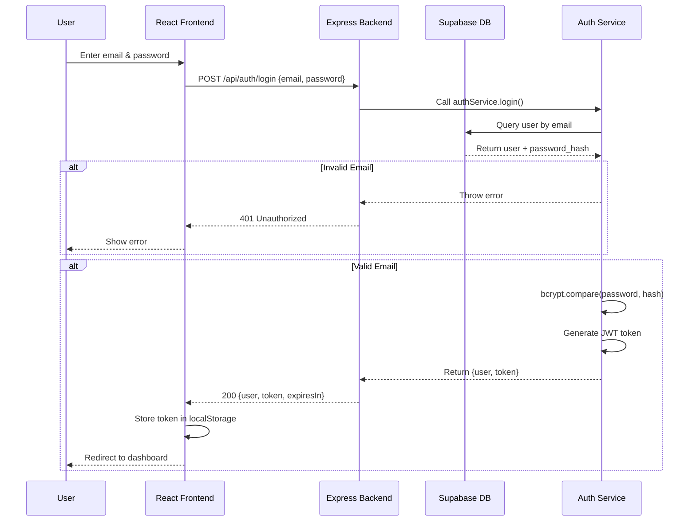

---

## AI/RAG Pipeline

### RAG System Architecture

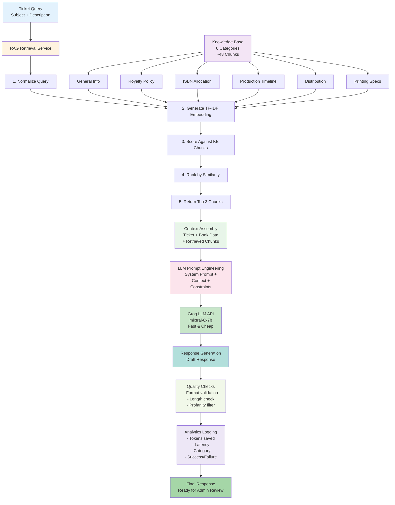

### Token Optimization Comparison

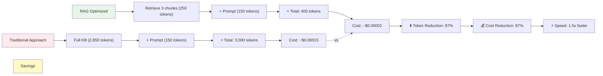

---

## Deployment Architecture

### Current Single-Node Deployment

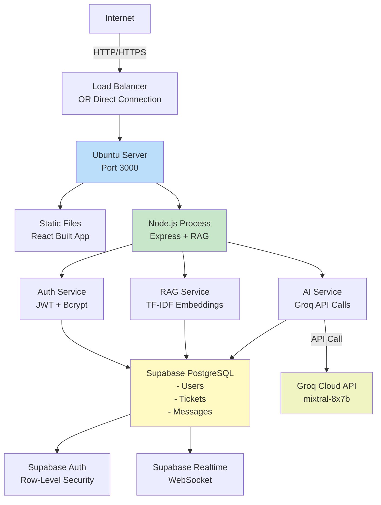

### Future Multi-Region Deployment

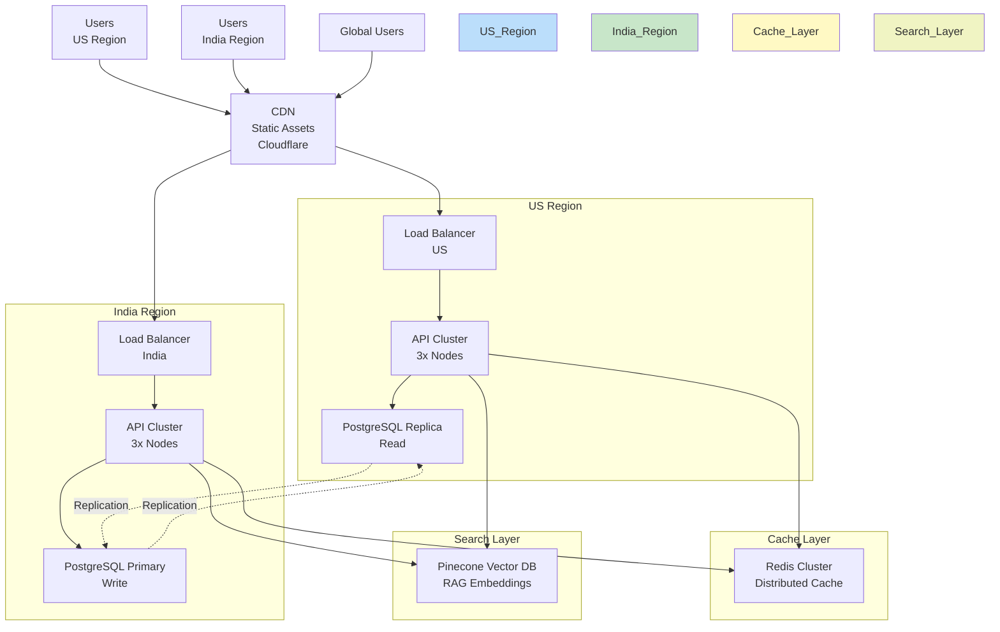

---

## File Structure with Architecture Mapping

```
BookLeaf/
│
├── server/                          # Express Backend
│   ├── src/
│   │   ├── config/                 # Config Layer
│   │   │   ├── env.js              # Environment validation
│   │   │   ├── groq.js             # Groq client initialization
│   │   │   └── supabase.js         # Supabase client setup
│   │   │
│   │   ├── controllers/            # HTTP Layer
│   │   │   ├── auth.controller.js
│   │   │   ├── tickets.controller.js
│   │   │   ├── ai.controller.js
│   │   │   ├── messages.controller.js
│   │   │   ├── books.controller.js
│   │   │   └── notes.controller.js
│   │   │
│   │   ├── services/               # Business Logic Layer
│   │   │   ├── auth.service.js     # Authentication logic
│   │   │   ├── tickets.service.js  # Ticket management
│   │   │   ├── books.service.js    # Book operations
│   │   │   ├── messages.service.js # Message handling
│   │   │   │
│   │   │   ├── ai/                 # AI Services
│   │   │   │   ├── aiClient.js     # LLM base client
│   │   │   │   ├── draft.service.js
│   │   │   │   ├── classify.service.js
│   │   │   │   ├── priority.service.js
│   │   │   │   └── process.service.js
│   │   │   │
│   │   │   └── rag/                # RAG Pipeline
│   │   │       ├── rag.service.js           # Main orchestrator
│   │   │       ├── embeddings.service.js    # TF-IDF engine
│   │   │       ├── chunking.service.js      # KB chunking
│   │   │       └── rag.analytics.js         # Metrics
│   │   │
│   │   ├── repositories/           # Data Access Layer
│   │   │   ├── user.repository.js
│   │   │   ├── ticket.repository.js
│   │   │   ├── book.repository.js
│   │   │   ├── message.repository.js
│   │   │   └── note.repository.js
│   │   │
│   │   ├── routes/                 # API Routes Layer
│   │   │   ├── auth.routes.js
│   │   │   ├── tickets.routes.js
│   │   │   ├── messages.routes.js
│   │   │   ├── ai.routes.js
│   │   │   ├── rag.routes.js
│   │   │   ├── books.routes.js
│   │   │   ├── notes.routes.js
│   │   │   └── authors.routes.js
│   │   │
│   │   ├── middleware/             # Cross-Cutting Concerns
│   │   │   ├── auth.middleware.js       # JWT verification
│   │   │   ├── role.middleware.js       # Authorization
│   │   │   ├── error.middleware.js      # Error handling
│   │   │   ├── validate.middleware.js   # Input validation
│   │   │   └── rateLimit.middleware.js  # Rate limiting
│   │   │
│   │   ├── prompts/                # LLM Prompt Templates
│   │   │   ├── draft.prompt.js
│   │   │   ├── classify.prompt.js
│   │   │   ├── priority.prompt.js
│   │   │   └── process.prompt.js
│   │   │
│   │   ├── knowledge-base/         # RAG Knowledge Chunks
│   │   │   ├── general.js          # General publishing info
│   │   │   ├── royalty.js          # Royalty policies
│   │   │   ├── isbn.js             # ISBN procedures
│   │   │   ├── production.js       # Production timelines
│   │   │   ├── distribution.js     # Distribution channels
│   │   │   └── printing.js         # Printing specs
│   │   │
│   │   ├── validators/             # Input Validators
│   │   │   ├── auth.validator.js
│   │   │   ├── ticket.validator.js
│   │   │   ├── message.validator.js
│   │   │   ├── note.validator.js
│   │   │   └── book.validator.js
│   │   │
│   │   ├── utils/                  # Utilities
│   │   │   ├── logger.js           # Logging
│   │   │   ├── apiResponse.js      # Response formatting
│   │   │   ├── AppError.js         # Error class
│   │   │   ├── pagination.js       # Pagination
│   │   │   └── helpers.js          # Helper functions
│   │   │
│   │   └── app.js                  # Express app setup
│   │
│   ├── scripts/
│   │   ├── seed.js                 # Database seeding
│   │   ├── createAdmin.js          # Admin creation
│   │   └── migrate.js              # DB migrations
│   │
│   ├── docs/
│   │   ├── RAG_IMPLEMENTATION.md
│   │   ├── SUPABASE_REALTIME_SETUP.sql
│   │   └── api-overview.md
│   │
│   ├── index.js                    # Server entry
│   ├── .env                        # Env variables
│   └── package.json
│
├── client/                         # React Frontend
│   ├── src/
│   │   ├── components/             # React Components
│   │   │   ├── Layout.jsx
│   │   │   ├── Sidebar.jsx
│   │   │   ├── PriorityBadge.jsx
│   │   │   ├── StatusBadge.jsx
│   │   │   ├── RealTimeMessages.jsx
│   │   │   └── authorComponents/
│   │   │
│   │   ├── pages/                  # Page Components
│   │   │   ├── Dashboard.jsx
│   │   │   ├── admin/
│   │   │   ├── author/
│   │   │   └── auth/
│   │   │
│   │   ├── context/                # React Context
│   │   │   └── AuthContext.jsx
│   │   │
│   │   ├── hooks/                  # Custom Hooks
│   │   │   └── useAuth.js
│   │   │
│   │   ├── services/               # API Services
│   │   │   └── api.js
│   │   │
│   │   ├── lib/                    # Libraries
│   │   │   └── supabase.js
│   │   │
│   │   ├── utils/
│   │   ├── main.jsx                # React entry
│   │   ├── App.jsx                 # Root component
│   │   └── index.css               # Global styles
│   │
│   ├── public/
│   ├── index.html
│   ├── vite.config.js
│   └── package.json
│
├── README.md                       # Main documentation
├── APPROACH_AND_EVOLUTION.md       # Design decisions
├── ARCHITECTURE.md                 # This file
├── IMPLEMENTATION_SUMMARY.md       # RAG implementation
└── BEFORE_AND_AFTER.md            # System evolution
```

---

## Layer Responsibilities

### Controllers (HTTP Layer)
- **Responsibility**: Parse HTTP requests, call services, format responses
- **Never**: Contains business logic, direct DB queries
- **Example**: `ticketsController.createTicket()` validates input, calls service, returns 201

### Services (Business Logic Layer)
- **Responsibility**: Orchestrate business operations, combine multiple operations
- **Manages**: Complex workflows, transactions, error recovery
- **Example**: `draftService.generate()` → retrieves context → calls RAG → calls LLM → logs analytics

### Repositories (Data Access Layer)
- **Responsibility**: Encapsulate all DB queries
- **Benefit**: Swap DB implementation without changing business logic
- **Example**: `ticketRepository.findById()` queries Supabase; could easily become MongoDB

### Middleware (Cross-Cutting Concerns)
- **Responsibility**: Auth, validation, error handling, rate limiting
- **Applied**: Globally or route-specifically
- **Example**: `authMiddleware` verifies JWT, `errorMiddleware` catches exceptions

---

## Scaling Considerations

### Current (1 Server)
- ✅ Works for <1000 DAU
- ⚠️ Single point of failure
- ✅ Easy to debug

### Next Step: Multi-Instance (6-12 months)
- Add load balancer
- Migrate to managed Redis (for rate limiting, cache)
- Add database read replicas
- Container orchestration (Docker + Kubernetes)

### Advanced: Multi-Region (1+ year)
- Regional API endpoints
- Database replication
- Vector database for RAG (Pinecone/Weaviate)
- CDN for static assets

---

## Security Architecture

### Authentication & Authorization

```mermaid
graph LR
    A["User Credentials<br/>email + password"]
    B["Bcrypt Hash<br/>10 rounds"]
    C["Verify Against<br/>Stored Hash"]
    D["Generate JWT<br/>exp: 24h"]
    E["JWT in Header<br/>Authorization: Bearer"]
    F["Middleware Verifies<br/>JWT Signature"]
    G["Check User Role<br/>admin vs author"]
    H["Access Allowed ✅"]
    
    A --> B
    B --> C
    C --> D
    D --> E
    E --> F
    F --> G
    G --> H
    
    style A fill:#ffebee
    style B fill:#ffccbc
    style C fill:#ffe0b2
    style D fill:#fff9c4
    style E fill:#f1f8e9
    style F fill:#c8e6c9
    style G fill:#b2dfdb
    style H fill:#a5d6a7
```

### Row-Level Security (Database Layer)

```sql
-- Example: Authors can only see their own tickets
CREATE POLICY "authors_see_own_tickets" ON tickets
  FOR SELECT
  USING (auth.uid()::text = author_id);

-- Admins see all
CREATE POLICY "admins_see_all_tickets" ON tickets
  FOR SELECT
  USING (
    EXISTS(
      SELECT 1 FROM users u 
      WHERE u.id = auth.uid() AND u.role = 'admin'
    )
  );
```

---

## Error Handling Strategy

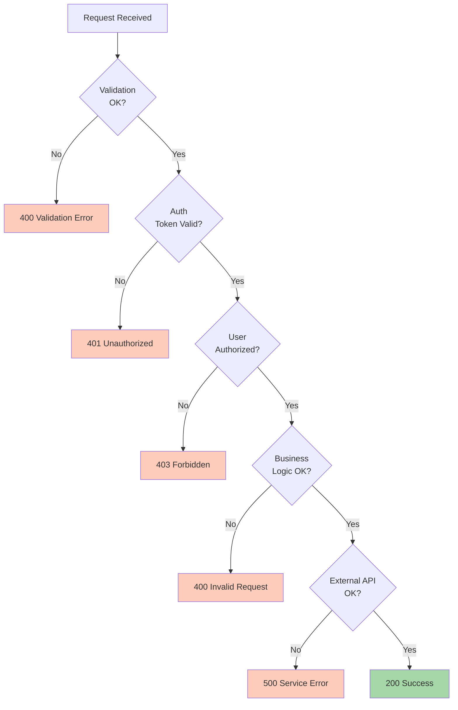

---

**End of Architecture & Design Documentation**
